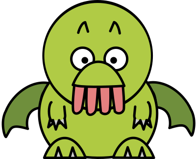

# Wumpus World - Reinforcement Learning

A classic AI problem implemented with modern RL techniques using **Stable-Baselines3** and **Gymnasium**.



## Overview

The Wumpus World is a grid-based environment where an agent must navigate through a cave to find gold while avoiding deadly hazards:

- 🟡 **Gold**: The agent's objective (+100 reward)
- 👹 **Wumpus**: A deadly creature that kills the agent (-100 reward)
- 🕳️ **Pits**: Bottomless pits that the agent falls into (-100 reward)
- 💨 **Breeze**: Indicates an adjacent pit
- 🦨 **Stench**: Indicates an adjacent Wumpus

## Features

- **Visual Rendering**: Beautiful pygame-based visualization with sprite assets
- **Stable-Baselines3 Integration**: Train with PPO, DQN, and other algorithms
- **Progress Tracking**: Real-time training metrics and plots
- **Gymnasium Compatible**: Uses the modern Gymnasium API

## Installation

```bash
# Using uv (recommended)
uv pip install -r requirements.txt

# Or using pip
pip install -r requirements.txt
```

## Quick Start

### Train an Agent

```bash
# Train PPO agent (default: 100k timesteps)
python train.py

# The training will:
# 1. Create 4 parallel environments
# 2. Train a PPO agent with optimized hyperparameters
# 3. Save the model to models/ppo_wumpus_final.zip
# 4. Generate training plots in plots/
```

### Watch a Trained Agent

```bash
python train.py play
```

### Interactive Play

```bash
# Play with keyboard controls (WASD or arrow keys)
python main.py play
```

### Test the Environment

```bash
python main.py test
```

## Environment Details

| Property | Value |
|----------|-------|
| Grid Size | 5×5 |
| Observation | 4 channels × 5 × 5 (Player, Pits, Wumpus, Gold) |
| Actions | 4 discrete (Up, Down, Left, Right) |
| Max Steps | 100 |

### Rewards

| Event | Reward |
|-------|--------|
| Move | -1 |
| Hit Wall | -5 |
| New Cell (exploration bonus) | +2 |
| Find Gold | +100 (win) |
| Fall in Pit | -100 (death) |
| Eaten by Wumpus | -100 (death) |

## Training Results

After training with PPO for 50k timesteps:

- **Win Rate**: ~40% (in evaluation)
- **Episodes**: ~1200+ completed
- **Mean Reward**: Improves from -300 to -50 range

Training produces plots showing:
- Episode rewards over time
- Evaluation performance
- Win rate progression
- Episode lengths

## Project Structure

```
wumpus/
├── train.py         # Stable-Baselines3 training script
├── main.py          # Interactive play and testing
├── wumpus_env.py    # Gymnasium environment
├── dqn_agent.py     # Custom DQN implementation (optional)
├── requirements.txt # Dependencies
├── assets/          # Visual assets for rendering
│   ├── agent.png
│   ├── wumpus.png
│   ├── gold.png
│   ├── pit.png
│   ├── breeze.png
│   ├── stench.png
│   └── empty.jpg
├── models/          # Saved models (after training)
├── plots/           # Training plots (after training)
└── logs/            # Training logs and TensorBoard data
```

## Custom Training

You can modify training hyperparameters in `train.py`:

```python
model = PPO(
    policy="MlpPolicy",
    env=env,
    learning_rate=3e-4,
    n_steps=256,
    batch_size=64,
    n_epochs=10,
    gamma=0.99,
    gae_lambda=0.95,
    clip_range=0.2,
    ent_coef=0.02,  # Higher for more exploration
    # ...
)
```

## TensorBoard

View training metrics in TensorBoard:

```bash
tensorboard --logdir=logs/tensorboard/
```

## Requirements

- Python 3.8+
- gymnasium
- stable-baselines3
- torch
- pygame
- matplotlib
- numpy

## License

MIT
